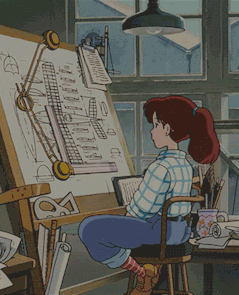
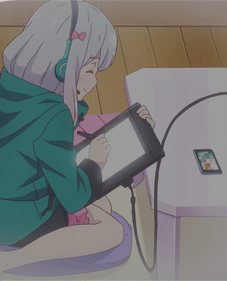
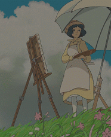
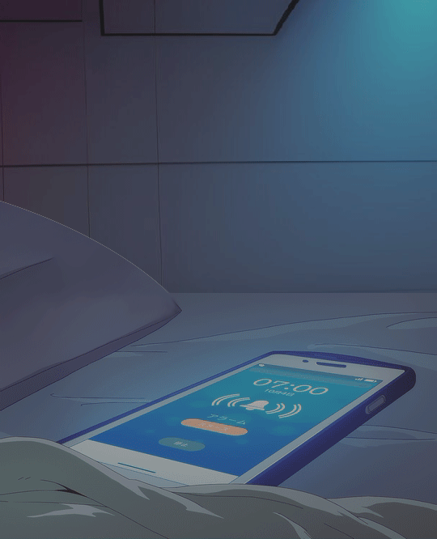
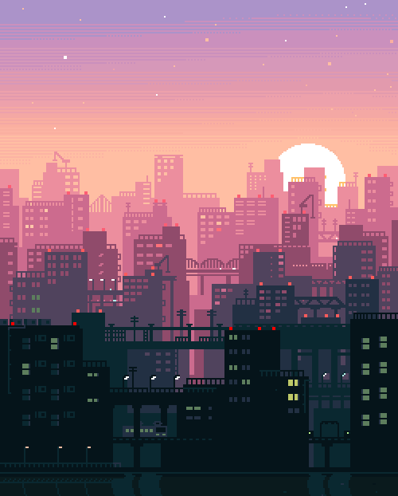
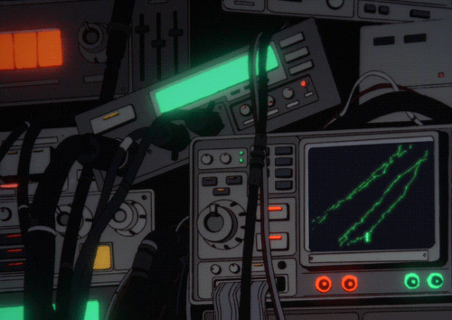
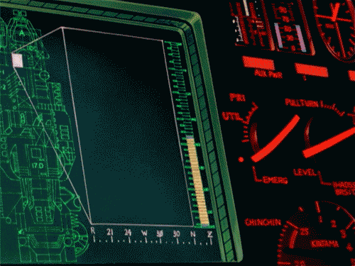
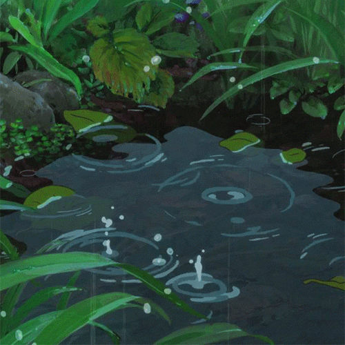
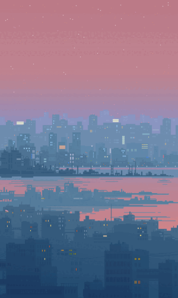
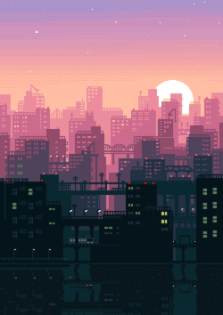

<h3 align="center">
  <br/>
  
  Catppuccin <a href="https://pivoshenko.github.io/catppuccin-startpage">Startpage</a>
  
</h3>

<p align="center">
  <a href="https://github.com/pivoshenko/catppuccin-startpage/stargazers">
    
  </a>
  <a href="https://github.com/pivoshenko/catppuccin-startpage/issues">
    
  </a>
  <a href="https://github.com/pivoshenko/catppuccin-startpage/contributors">
    
  </a>
</p>

<p align="center">
  
</p>

## 🪴 Overview

Aesthetic and clean startpage in [**Catppuccin**](https://catppuccin.com/palette) style, hosted on GitHub Pages.
This startpage is based on the [`dawn`](https://github.com/b-coimbra/dawn), which has even more functionality.
I've tweaked the page to match my [`dotfiles`](https://github.com/pivoshenko/dotfiles) so check them out as well.

### 🧠 Main principles

- Minimalism in everything
- Consistency
- Simplicity
- One style
- Reduced visual noise

### 🎨 Supported Palettes

- Latte
- Frappé
- Macchiato
- Mocha

### ✨ Gemini AI Integration

This startpage now includes **Google Gemini AI** integration! 

- 🔍 **Dual Search Mode**: Toggle between Google Search and Gemini AI (press `Tab` in search)
- 🪟 **Expanded Results Window**: Beautiful modal overlay for AI responses
- 🎨 **Markdown Support**: Formatted responses with code blocks, lists, and more
- ⌨️ **Keyboard Shortcuts**: Quick access with `/` key

> [!NOTE]
> To use Gemini AI, you'll need a free API key from [Google AI Studio](https://makersuite.google.com/app/apikey).
> See [GEMINI_SETUP.md](GEMINI_SETUP.md) for detailed setup instructions.

### 🌍 Localization

This startpage now supports **multiple languages**!

- 🇪🇸 **Spanish** (default)
- 🇬🇧 **English**
- 📅 **Localized dates**: Day names, month names, and time formats
- 🔍 **Localized UI**: Search placeholders, weather conditions, and more

**Change language:**
```javascript
// Open browser console (F12) and run:
window.i18n.setLocale('en'); // English
window.i18n.setLocale('es'); // Spanish
location.reload();
```

> [!TIP]
> See [LOCALIZATION.md](LOCALIZATION.md) for detailed documentation on adding new languages and using the i18n API.

## 🪵 Usage

1. Fork this repository and clone it
2. Optionally remove the `.github` directory as it contains only PR templates, issue labels, etc that are linked to this repository
3. Update [`userconfig.js`](userconfig.js):
   - Set the desired palette: `latte / frappe / macchiato / mocha`
   - Set your location for the weather widget
   - Update the number of pages and their banners
   - Update bookmarks and quick links for the one you are using the most :3

> [!TIP]
> You can find icons for your bookmarks using [`tabler-icons`](https://tabler.io/icons)
>
> If you want to reduce the loading time of the icons, you could install the icon [font](src/fonts) locally and activate the option `"localIcons": true` in the config to disable the remote styles

#### As Homepage

- Click the menu button and select `Options/Preferences`
- Click the home panel
- Click the menu next to the homepage and new windows and choose to show custom URLs and add your GitHub Pages link

#### As New Tab

You can use different add-ons/extensions for it

- If you use Firefox: [Custom New Tab Page](https://addons.mozilla.org/en-US/firefox/addon/custom-new-tab-page/?src=search) and make sure you enable "Force links to open in the top frame (experimental)" in the extension's preferences page
- If you use Chromium (Brave / Chrome): [Custom New Tab URL](https://chrome.google.com/webstore/detail/custom-new-tab-url/mmjbdbjnoablegbkcklggeknkfcjkjia)

### 🖼️ Available banners

| banner_01 | banner_02 | banner_03 | banner_04 |
| --- | --- | --- | --- |
|  |  |  |  |

| banner_05 | banner_06 | banner_07 | banner_08 |
| --- | --- | --- | --- |
|  |  |  |  |

| banner_09 | banner_10 | banner_11 | banner_12 |
| --- | --- | --- | --- |
|  |  |  |  |

| banner_13 | banner_14 | banner_15 | banner_16 |
| --- | --- | --- | --- |
|  |  |  |  |

| banner_17 | banner_18 | bg-1 | bg-2 |
| --- | --- | --- | --- |
|  |  |  |  |

| bg-3 | cbg-1 | cbg-2 | cbg-3 |
| --- | --- | --- | --- |
|  |  |  |  |

| cbg-4 | cbg-5 | cbg-6 | cbg-7 |
| --- | --- | --- | --- |
|  |  |  |  |

| cbg-8 | cbg-9 | cbg-10 | cbg-11 |
| --- | --- | --- | --- |
|  |  |  |  |

| cbg-12 | cbg-13 |  |  |
| --- | --- | --- | --- |
|  |  |  |  |
